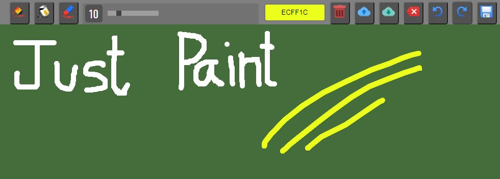

`Just Paint` is a very basic browser-driven (HTML Canvas) paint app.

## Tools >

- Brush: Tools to draw on canvas.
- Bucket: Change canvas background color.
- Eraser: Earse partial drawn element.
- Slider: Size of Brush or Eraser.
- Color Picker: Pick a color.
- Clear canvas: Clear everything from canvas.
- Save Local Storage: Save current canvas to browser local storage.
- Load local storage: Load currently saved canvas from browser local storage.
- Delete local storage: Delete the currently saved canvas from the browser local storage.
- Undo: Partially go backwards.
- Redo: Partially go forward.
- Save: Save to local drive.
