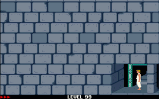

# Prince of Persia (JS) - princejs.com

Prince of Persia (MS-DOS version) reimplementation written in HTML5 & JavaScript ES6

## Play Online

- Browser: https://princejs.com
- Keyboard
  - `Cursor keys`: Movement
    - `Left / Right key`: Move Left/Right, Advance/Retreat
    - `Up key`: Jump, Climb Up, Block Attack
    - `Down key`: Crouch, Crawl, Climb Down, Sheathe Sword
  - `SHIFT`: Drink Potion, Grab Edge, Sword Strike
  - `SPACE`: Show Remaining Time
  - `ENTER`: Continue Game
- Mouse
  - See Touch Controls for Mobile
- Game Controller
  - `Left / Right Stick, DPad`: Movement
    - `Left / Right`: Move Left/Right, Advance/Retreat
    - `Up`: Jump, Climb Up, Block Attack
    - `Down`: Crouch, Crawl, Climb Down, Sheathe Sword
  - `A / R / ZR Button`: Jump, Climb Up, Block Attack
  - `B / Y / L / ZL Button`: Drink Potion, Grab Edge, Sword Strike
  - `X`: (1x) Show Remaining Time, (2x) Restart Level
  - `Minus Button`: Previous Level
  - `Plus Button`: Next Level
  - `Any`: Continue Game

## Play Mobile

- Browser: https://princejs.com
  - Use Landscape Mode
  - Single Tab
  - Disable Landscape Tab Bar in Browser Settings
- Add to Home Screen to start as Fullscreen App
- Reduced difficulty (50%):
  - https://princejs.com?strength=50
- Touch Controls (tap/drag area on screen, fight mode in brackets):

  

  - Dragging can be used to trigger continuous move sequences, e.g.
    - _Run Jump_: Tap Left or Right -> Hold -> Drag in Left or Right corner
    - _Jump Grab_: (Run) Jump -> Hold -> Drag to Center (Shift)
  - Fight
    - _Left/Right_: Advance/Retreat
    - _Shift_: Sword Strike
    - _Up_: Block Attack
    - _Down_: Sheathe Sword

## Play on Apple Watch

- Mail/Message
  - Send mail or message to yourself with body: https://princejs.com
  - On Apple Watch open Mail or Message app
  - Click included link to open Browser
- Siri
  - Tell Siri 'princejs.com' on Apple Watch
  - Watch out for correct localized pronunciation
- Play using Touch Controls as on Mobile

## Play Locally

- Install [Node.js](https://nodejs.org)
- Clone: `https://github.com/ajfm88/javascript-30-projects.git`
- Terminal:
  - `cd 28-prince-of-persia`
  - `npm install`
  - `npm start`
- Browser: `localhost:8080`

## Options

Url parameters are leveraged to save game state automatically (shortcut in brackets)

- `level (l)`: Current Level (1-14, default: 1)
- `health (h)`: Max Health (3-10, default: 3)
- `time (t)`: Remaining Minutes (1-60, default: 60)
- `strength (s)`: Guard Strength in "%" (0-100, default: 100)
- `width (w)`: Game Width in "px" (default: 0 (fit to screen))
- `shortcut (_)`: Write url in shortcut version (default: false)

Default url looks as follows:

https://princejs.com?level=1&health=3&time=60&strength=100&width=0

Default shortcut url looks as follows:

https://princejs.com?l=1&h=3&t=60&s=100&w=0&_=true

Manual adjustments of url parameters is possible as preset options.

## Custom Levels

Apoplexy (https://www.apoplexy.org) can be used to build custom levels.
Custom levels can be played performing the following steps.

### Single Conversion

- Save level as XML file in Apoplexy, e.g. `./xml/level1.xml`
- Call convert script, e.g. `npm run convert .../xml/level1.xml`
  - A JSON file is placed at `/assets/maps/`, e.g. `/assets/maps/level101.json`
- Custom level ids starts beyond 100, e.g. `level1.xml` gets id `101`, etc.
  - An optional second parameter can be used to control level offset
  - e.g. `npm run convert .../xml/level1.xml 200` generates `/assets/maps/level201.json`
- Start game locally with `npm start` and open game in browser
- Change Url and set parameter `level` to the respective id, e.g. `level=101`
- Note: No special events are supported

### Batch Conversion

- Place level files into folder `/converter/<xxx>`, where `<xxx>` stands for the offset (default: 100)
  - e.g. `/converter/100`: place all levels starting with 100 offset
- Execute `npm run convert`
- Corresponding JSON files are placed at `/assets/maps/`

### Level Numbers

Converted levels from https://www.popot.org/custom_levels.php:

- [99](https://princejs.com?level=99&strength=50): Chamber Play (own)
- [100](https://princejs.com?level=100&strength=50): Tower of Revenge (own)
- [101-114](https://princejs.com?level=101&strength=50): Prince of Persia Revisited ([source](https://www.popot.org/custom_levels.php?mod=0000163))
- [115-128](https://princejs.com?level=115&strength=50): Jaffar's House ([source](https://www.popot.org/custom_levels.php?mod=0000220))
- [129-142](https://princejs.com?level=129&strength=50): Ipank's Levels ([source](https://www.popot.org/custom_levels.php?mod=0000151))
- [143-156](https://princejs.com?level=143&strength=50): Barre's Alternative ([source](https://www.popot.org/custom_levels.php?mod=0000189))
- [157-170](https://princejs.com?level=157&strength=50): Miracles Don't Exist ([source](https://www.popot.org/custom_levels.php?mod=0000098))
- [171-184](https://princejs.com?level=171&strength=50): Babylon Tower Climb ([source](https://www.popot.org/custom_levels.php?mod=0000109))
- [185-198](https://princejs.com?level=185&strength=50): Lost in Errors ([source](https://www.popot.org/custom_levels.php?mod=0000144))
- [199-212](https://princejs.com?level=199&strength=50): Story Retold ([source](https://www.popot.org/custom_levels.php?mod=0000146))
- [213-226](https://princejs.com?level=213&strength=50): Prince of Persia Guard Revolt ([source](https://www.popot.org/custom_levels.php?mod=0000162))
- [227-240](https://princejs.com?level=227&strength=50): Return of Prince ([source](https://www.popot.org/custom_levels.php?mod=0000207))
- [241-254](https://princejs.com?level=241&strength=50): The Sequel ([source](https://www.popot.org/custom_levels.php?mod=0000273))
- [255-268](https://princejs.com?level=255&strength=50): Nahemsan ([source](https://www.popot.org/custom_levels.php?mod=0000272))
- [269-282](https://princejs.com?level=269&strength=50): 4-Rooms Levelset ([source](https://www.popot.org/custom_levels.php?mod=0000052))
- [283-296](https://princejs.com?level=283&strength=50): Repetition of Time ([source](https://www.popot.org/custom_levels.php?mod=0000010))
- [297-310](https://princejs.com?level=297&strength=50): Same Story Different Version ([source](https://www.popot.org/custom_levels.php?mod=0000276))

### Level Walkthrough

- **Level 99:** https://youtu.be/Aj3tfAaXD4c

- **Level 100:** https://youtu.be/PAHACXdWQ_M

## Credits

- https://github.com/oklemenz ([PrinceJS v2](https://github.com/oklemenz/PrinceJS))
- https://github.com/ultrabolido ([PrinceJS v1](https://github.com/ultrabolido/PrinceJS))
- https://github.com/jmechner ([Prince-of-Persia-Apple-II](https://github.com/jmechner/Prince-of-Persia-Apple-II))
